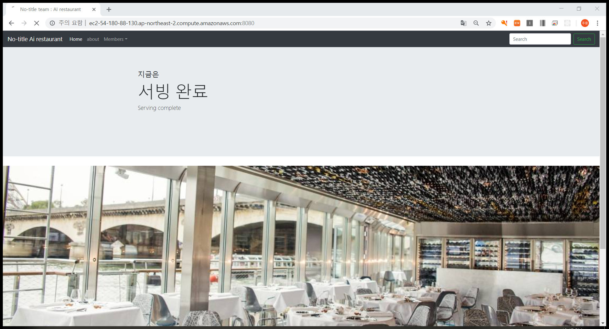
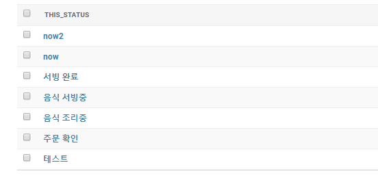

# iot-monitoring-service
django python code

## install
python -m venv <가상환경이름>

source <가상환경이름>/bin/activate

pip install django

python manage.py runserver 0:8080

종료 : ctrl+C, deactivate

8080 포트에 대해서 보안그룹 인바운듯 아웃바운드를 오픈해야됨.

보안상 settings.py의 allowed_hosted를 수정해야 좋음.

## description

간단한 모니터링 웹서비스를 구현하기 위해 aws-EC2와 django를 사용하였음.

몇초마다 새로고침을 실행하기 위해 자바스크립트 코드를 사용했고 나머진 python코드를 사용하였음.

위그림처럼 미리 데이터를 저장해야 동작함.

now에는 1~5까지 저장되며 test~서빙완료를 나타냄

/notify/<int:id>으로 접속해서 now 의 content값을 수정하게 되며 이는 이에 대응하는 상태값으로 home페이지에 표시됨.
